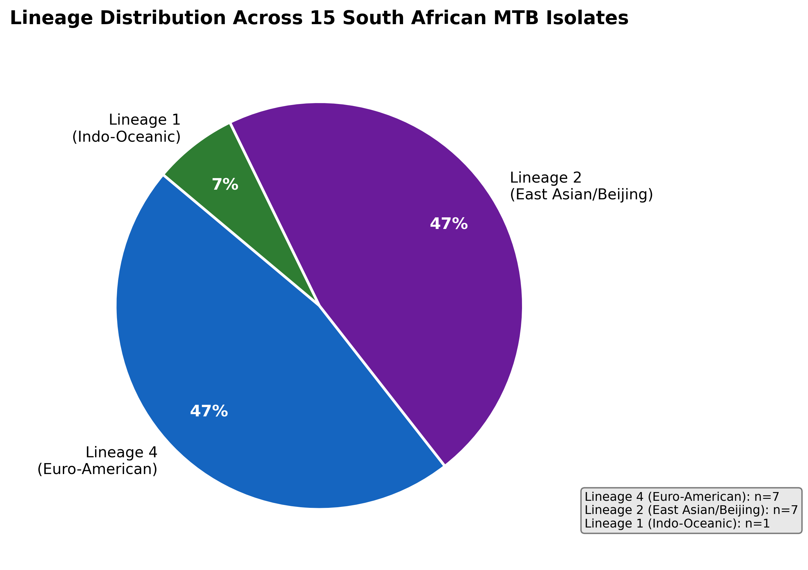
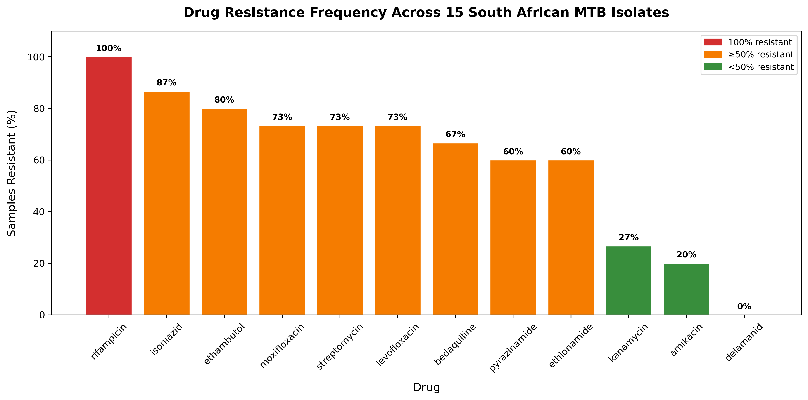
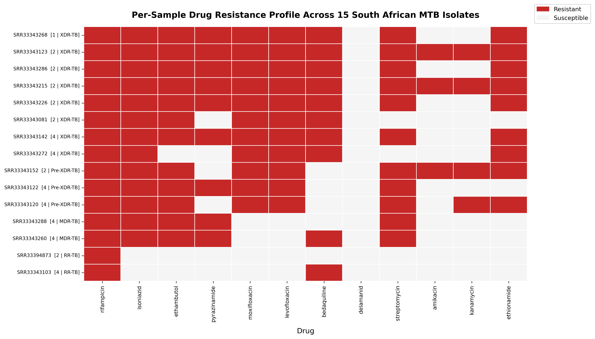

# Drug Resistance Profiling of _Mycobacterium tuberculosis_ Genomes

This project provides a reproducible bioinformatics pipeline for whole-genome sequencing (WGS)-based drug resistance profiling and lineage classification of _Mycobacterium tuberculosis_ (MTB) isolates from South Africa.

---

## Background

Tuberculosis (TB), caused by _Mycobacterium tuberculosis_ (MTB), is the world's leading cause of death from a single infectious agent. It was also the leading killer of people with HIV in 2024 [1]. Unfortunately, 69% of all HIV-associated TB cases in the world occur in the African Region, with South Africa being heavily affected [2].

It takes a standard 6-month regimen to treat drug-susceptible TB. However, mutations in certain MTB genes are fueling the emergence of drug-resistant TB. First-line drugs are ineffective against drug-resistant TB, so clinicians have to resort to later-generation drugs that are more expensive and toxic [3]. Additionally, treatment with these later-generation drugs can take up to 18–24 months [2].

Diagnosing TB is another hurdle. TB is an airborne disease, but it develops slowly. Traditional solid media culturing (in the lab) takes 4–6 weeks. Identifying which drugs a cultured isolate is resistant to also adds more weeks to the timeline [4]. Fortunately, recent progress in computational genomics offers a faster alternative. Whole-genome sequencing (WGS) of MTB, along with bioinformatics tools like TB-Profiler, makes it easier to comprehensively profile resistance directly from a cultured isolate. These tools can also do lineage classification and variant-level resolution of resistance mechanisms [5].

For this project, samples were drawn from BioProject PRJNA1256480 (B-Prepared, Columbia University), a whole-genome sequencing dataset of South African TB isolates deposited in April 2025 [6]. No associated publication was available at the time of analysis.

---

## Pipeline Overview

The pipeline consists of six sequential steps:

1. **Sample selection:** 15 paired-end Illumina WGS MTB isolates from South Africa selected from NCBI SRA (BioProject PRJNA1256480) and documented in `data/accessions.csv` and `data/SRR_Acc_List.txt`.

2. **Data download:** Raw FASTQ files downloaded using SRA Toolkit (`prefetch` + `fasterq-dump`).

3. **Quality control:** Raw reads assessed with FastQC, trimmed with Trimmomatic (adapter removal, quality filtering, minimum length 36bp), and post-trim reads re-assessed with FastQC.

4. **Drug resistance profiling:** TB-Profiler aligns trimmed reads to the MTB H37Rv reference genome, calls variants, predicts resistance to 18 drugs, and classifies each isolate's lineage.

5. **Results aggregation:** Individual TB-Profiler JSON outputs collated into a structured summary CSV using `tb-profiler collate`.

6. **Analysis and visualisation:** Python script using Pandas, Matplotlib, and Seaborn produces three publication-quality figures and a structured resistance summary.

---

## Repository Structure

```bash
mtb-drug-resistance-pipeline/
├── README.md                   # This file
├── REPORT.md                   # Biological interpretation of findings
├── environment.yml             # Conda environment specification
├── data/
│   ├── accessions.csv          # Sample metadata (15 South African MTB isolates)
│   └── SRR_Acc_List.txt        # SRA accession numbers (one per line)
├── scripts/
│   ├── download_samples.sh     # Downloads raw FASTQ files from NCBI SRA
│   ├── run_qc.sh               # Runs FastQC and Trimmomatic on all samples
│   ├── run_tbprofiler.sh       # Runs TB-Profiler on all trimmed samples
│   └── aggregate_and_visualise.py # Aggregates results and produces figures
├── logs/                       # Per-sample logs for each pipeline step
├── results/
│   ├── qc/
│   │   ├── raw/                # FastQC reports for raw reads
│   │   └── trimmed/            # FastQC reports for trimmed reads
│   ├── tbprofiler/
│   │   ├── tbprofiler_summary.csv      # Collated resistance and lineage summary
│   │   └── tbprofiler_summary.variants.csv # Detailed variant calls per sample
│   └── figures/
│       ├── fig1_resistance_frequency.png  # Bar chart: resistance frequency per drug
│       ├── fig2_lineage_distribution.png  # Pie chart: lineage distribution
│       └── fig3_resistance_heatmap.png    # Heatmap: per-sample resistance profiles
```

---

## Requirements

- **OS:** Linux (developed and tested on Arch Linux with i3wm)
- **Miniforge/Mamba:** v24+ (for conda environment management)
- **Java:** Java 21 (required for SnpEff, used internally by TB-Profiler)
- **Disk space:** ~40GB during pipeline execution (raw FASTQs are deleted after trimming)
- **RAM:** 8GB minimum recommended

---

## Environment Setup

### 1. Install Miniforge

```bash
curl -L -O "https://github.com/conda-forge/miniforge/releases/latest/download/Miniforge3-$(uname)-$(uname -m).sh"
bash Miniforge3-$(uname)-$(uname -m).sh
```

### 2. Configure conda channels

```bash
conda config --set channel_priority strict
```

### 3. Create the environment

```bash
mamba env create -f environment.yml
```

If the environment already partially exists due to an interrupted install:

```bash
mamba env update --name tb-bioinformatics -f environment.yml --prune
```

### 4. Activate the environment

```bash
conda activate tb-bioinformatics
```

### 5. Install Java 21 (required for SnpEff)

```bash
# On Arch Linux
sudo pacman -S jdk21-openjdk

# Set Java 21 as active for the session
export JAVA_HOME=/usr/lib/jvm/java-21-openjdk
export PATH=$JAVA_HOME/bin:$PATH
```

### 6. Verify all tools

```bash
fastqc --version        # Expected: FastQC v0.12.1
trimmomatic -version    # Expected: 0.39
tb-profiler version     # Expected: tb-profiler version 6.3.0
prefetch --version      # Expected: prefetch 3.1.1
java -version           # Expected: openjdk 21.x.x
```

### Troubleshooting

I included the right `setuptools` version in the `environment.yml file`, so you shouldn't face this issue. But if `tb-profiler version` command in Step 6 fails with a `ModuleNotFoundError: No module named 'pkg_resources'` error, it means TB-Profiler has a broken dependency: `pkg_resources` is missing, which is part of `setuptools`.

Newer setuptools (72+) removed `pkg_resources`, which TB-Profiler depends on. Downgrade it:

```bash
python -m pip install "setuptools<72"
```

---

## Usage

All scripts should be run from the project root directory with the `tb-bioinformatics` environment activated.

### Step 1: Download samples

```bash
bash scripts/download_samples.sh 2>&1 | tee logs/download.log
```

### Step 2: Quality control

```bash
bash scripts/run_qc.sh 2>&1 | tee logs/qc.log
```

### Step 3: Drug resistance profiling

```bash
bash scripts/run_tbprofiler.sh 2>&1 | tee logs/tbprofiler.log
```

### Step 4: Collate TB-Profiler results

```bash
tb-profiler collate \
    --dir results/tbprofiler/results \
    --prefix results/tbprofiler/tbprofiler_summary \
    --format csv
```

### Step 5: Aggregation and visualisation

```bash
/path/to/conda/envs/tb-bioinformatics/bin/marimo edit scripts/aggregate_and_visualise.py
```

Replace `/path/to/conda/envs/` with your actual Miniforge installation path (e.g. `/home/{username}/miniforge3/envs/`).

---

## Results Summary

### Lineage Distribution



Of the 15 isolates, 47% belonged to Lineage 4 (Euro-American) and 47% to Lineage 2 (East Asian/Beijing). Lineage 2 is strongly associated with drug resistance acquisition. One isolate (7%) belonged to Lineage 1 (Indo-Oceanic).

### Drug Resistance Frequency



All 15 isolates were rifampicin-resistant. Isoniazid resistance was observed in 87% of isolates. Fluoroquinolone resistance (moxifloxacin and levofloxacin) was detected in 73% of isolates, and bedaquiline resistance in 67%. No isolate showed resistance to delamanid, linezolid, pretomanid, or para-aminosalicylic acid.

### Per-Sample Resistance Profiles



8 of 15 isolates were classified as XDR-TB, 3 as Pre-XDR-TB, 2 as MDR-TB, and 2 as RR-TB. The heatmap shows resistance patterns sorted by severity, with XDR-TB isolates displaying broad multi-drug resistance.

---

## Biological Interpretation

This cohort reveals a high prevalence of extensively drug-resistant tuberculosis in South African MTB isolates. There was universal rifampicin resistance, near-universal isoniazid resistance, and high rates of fluoroquinolone and bedaquiline resistance. Delamanid, linezolid, and pretomanid are the only primary newer-generation drugs that recorded zero resistance across all 15 samples. Also, the near-equal prevalence of Lineage 2 (associated with resistance acquisition) and Lineage 4 (associated with transmissibility) represents a serious public health concern.

See [REPORT.md](REPORT.md) for the full biological interpretation, including mutation-level analysis, clinical implications, and study limitations.

---

## References

1. World Health Organization. _Tuberculosis Fact Sheet_. https://www.who.int/news-room/fact-sheets/detail/tuberculosis
2. World Health Organization. _Global Tuberculosis Report 2025_. https://www.who.int/teams/global-tuberculosis-programme/tb-reports/global-tuberculosis-report-2025
3. World Health Organization. (2016). _WHO treatment guidelines for drug-resistant tuberculosis, 2016 update._ https://doi.org/10.1183/13993003.02308-2016
4. Pfyffer, G. E. (2015). _Mycobacterium_: General characteristics, laboratory detection, and staining procedures. _Manual of Clinical Microbiology_, 536–569.
5. Phelan, J. E., et al. (2019). Integrating informatics tools and portable sequencing technology for rapid detection of resistance to anti-tuberculous drugs. _Genome Medicine_, 11(41). https://doi.org/10.1186/s13073-019-0650-x
6. Columbia University. (2025). B-Prepared: Whole-genome sequencing of South African TB isolates. NCBI BioProject PRJNA1256480. https://www.ncbi.nlm.nih.gov/bioproject/PRJNA1256480
7. Gagneux, S., et al. (2006). Variable host–pathogen specificity in _Mycobacterium tuberculosis_, and its implications for TB epidemiology and vaccine efficacy. _PNAS_, 103(8), 2869–2873.
8. Chihota, V. N., et al. (2012). Population structure of _M. tuberculosis_ in South Africa: a review. _International Journal of Tuberculosis and Lung Disease_.
9. World Health Organization. (2021). WHO consolidated guidelines on tuberculosis. Module 3: Diagnosis. Geneva: WHO.
10. Conradie, F., et al. (2020). Treatment of Highly Drug-Resistant Pulmonary Tuberculosis. _New England Journal of Medicine_, 382(10), 893–902.
11. World Health Organization. (2021). _Catalogue of mutations in Mycobacterium tuberculosis complex and their association with drug resistance_. Geneva: WHO.
